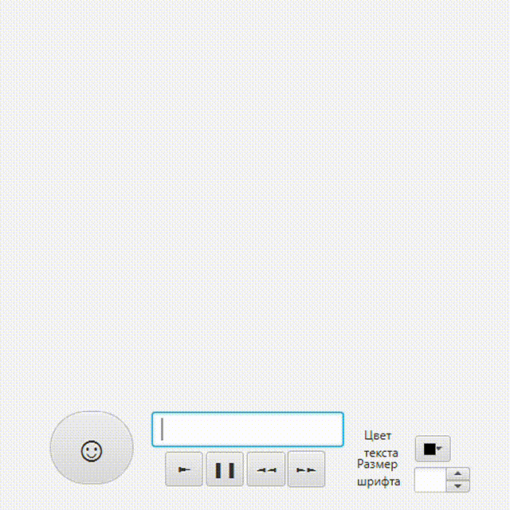

## Task5 | строитель
### Задача Т
ребуется разработать Индикатор выбранного процесса, например время до дедлайна, настроения, заполнения и пр.
Их можно cоставить из "готовых" объектов Shape и инициализировать различными значениями как для изменения их внешнего представления, так и загрузки отражаемых параметров.
Хорошим решением этой задачи является использование паттерна Строитель. 

### Теоретическая справка
Паттерн Строитель (Builder)  используется для создания новых объектов по одному и тому же процессу конструирования. Это даёт возможность использовать один и тот же алгоритм процесса строительства для получения разных видов объектов.

Интерфейс Builder объявляет шаги конструирования продуктов, общие для всех видов строителей.

ConcreteBuilder реализуют шаги конструирования, каждый по-своему. Конкретные строители могут производить объекты разного представления.

Product  — создаваемый объект.  

Director определяет порядок вызова строительных шагов для построения той или иной конфигурации продуктов.

Client - контекст использования паттерна.

Использования Строителя:

дает больший контроль над процессом создания объектов;

позволяет варьировать внутреннее представление объекта;

отделяет процесс конструирования объекта от его внутреннего представления

### Результат

